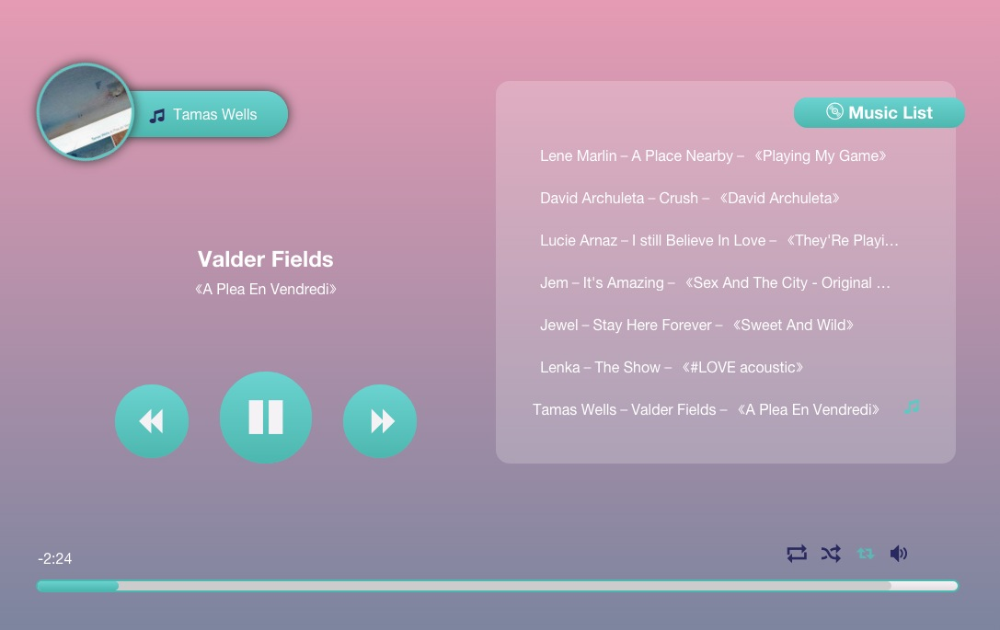

#Angularjs-Player

####用angularjs做的h5和c3的音乐播放器

####里边还有需优化的地方和一些bug需修复，ps：后续有空的时候再研究

####修复
>- update body font color to beautify the UI(thx,@ 彭博)
>- update font-family for Mac User(thx,@ 彭博)
>- 将src改成ng-src, href改成ng-href
>- 修复无时无刻都可以进行........

#####弱弱的附上一个链接：[请戳这里](http://www.uselessblog.cn/JQM-me/player/)

